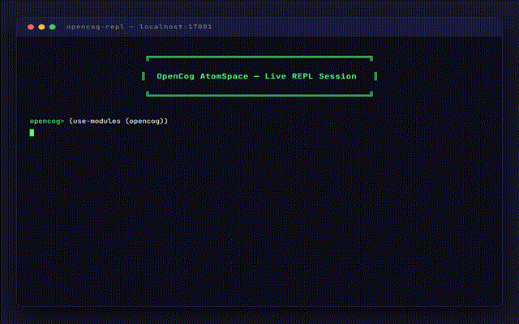
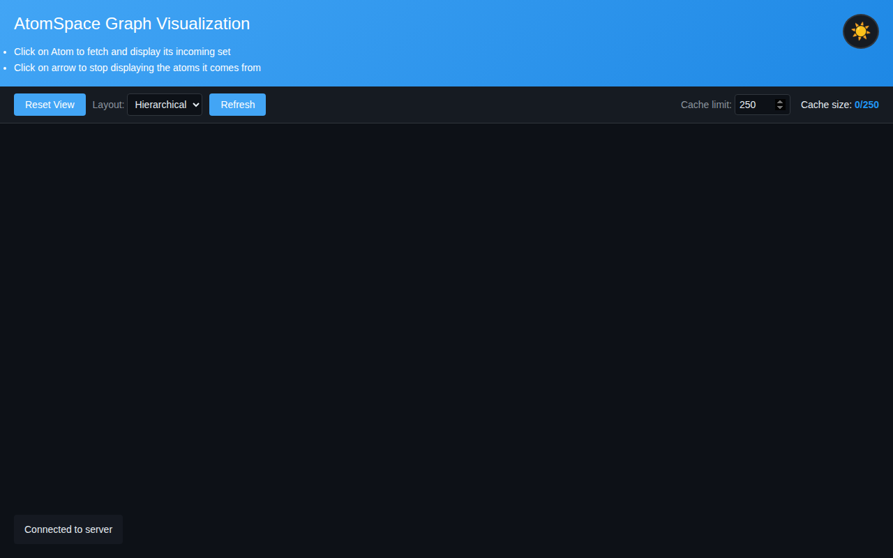
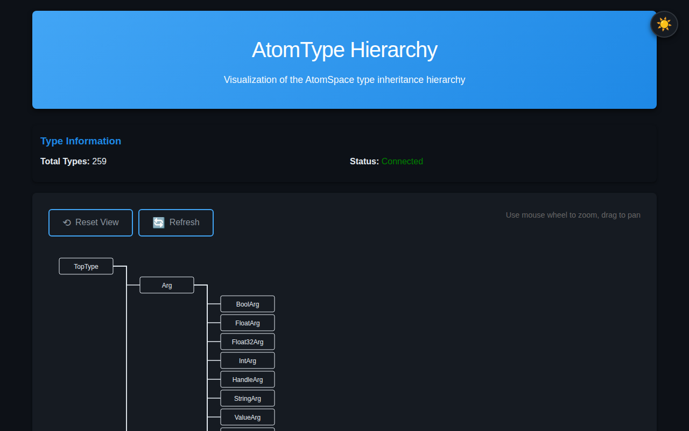
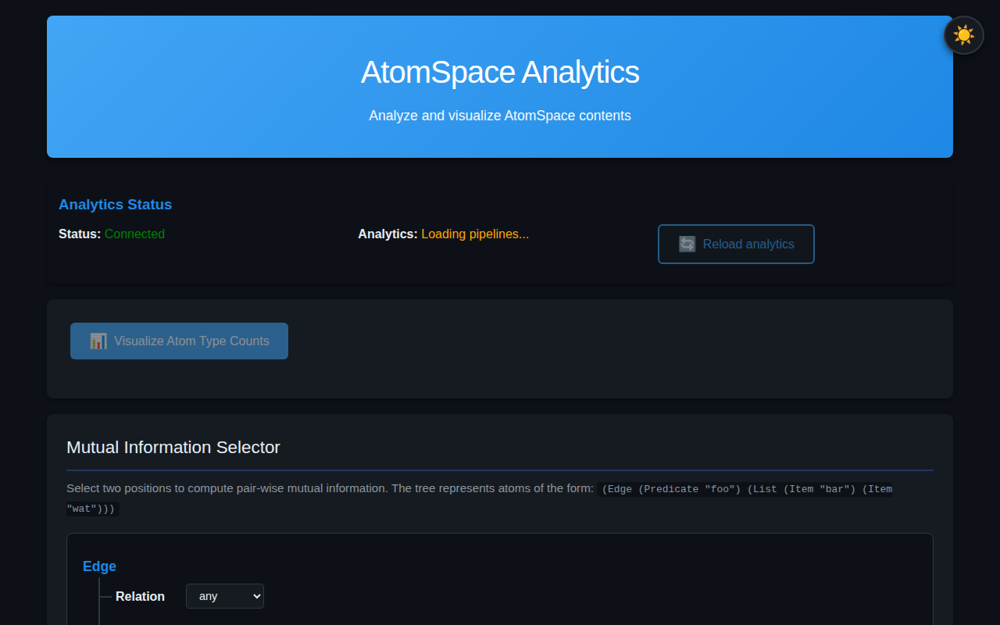
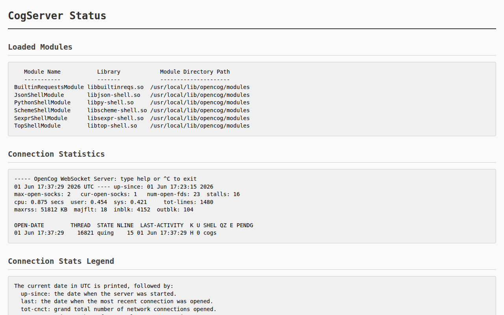

# OpenCog AtomSpace — Live Demo Stack

> **In-memory hypergraph knowledge database** with a running CogServer, WebSocket REPL, and web visualizer. Built from source on Ubuntu 24.04 / GCC 14 — commit [`c8d633bf27`](https://github.com/opencog/atomspace/commit/c8d633bf27) (v5.0.3-stable).

<p align="center">
  <a href="https://opencog.org"></a>
  <a href="LICENSE"></a>
  <a href="https://github.com/opencog/atomspace"></a>
  <a href="CONTRIBUTORS.md"></a>
  <a href="Dockerfile"></a>
  <a href=".github/workflows/verify.yml"></a>
  <a href="https://discord.gg/vxPc6sz"></a>
</p>

---

## Quick Start

```bash
telnet localhost 17001    # Connect to the Scheme REPL
```

Then create your first atoms:

```scheme
(ConceptNode "hello-world")
(ConceptNode "opencog")
(InheritanceLink (ConceptNode "cat") (ConceptNode "animal"))
(cog-evaluate! (Plus (Number 1) (Number 2)))
(cog-execute! (Get (InheritanceLink (VariableNode "$X") (ConceptNode "animal"))))
```

**Also try:**
- **WebSocket Shell** — [`http://localhost:18080/websockets/demo.html`](http://localhost:18080/websockets/demo.html)
- **Guided tour** — `cat demo/comprehensive-demo.scm | nc localhost 17001`
- **3D Visualizer** — [`http://localhost:18080/visualizer/`](http://localhost:18080/visualizer/)

---

## Features

| Capability | How |
|---|---|
| **Hypergraph database** | Typed, directed metagraph — edges connect any number of nodes, and edges can point to edges |
| **Pattern matching** | Subgraph isomorphism queries with variables — `GetLink`, `BindLink` |
| **Graph rewriting** | Automatic knowledge inference — match a pattern, instantiate a rewrite |
| **Interactive REPL** | Telnet (port 17001) + WebSocket (port 18080) — Scheme, Python, JSON, S-expressions |
| **3D visualizer** | 6 browser views: 3D graph, tree, type distribution, analytics dashboard, WebSocket shell, JSON tester |
| **Persistence** | RocksDB and PostgreSQL backends |
| **6-language API** | Python, JavaScript, Go, Ruby, Rust, curl — all over WebSocket JSON protocol |
| **Docker support** | Single-command build and run |
| **CI/CD** | GitHub Actions workflow builds, starts, and tests the full stack |

---

## Demo

<p align="center">
  
  <br>
  <em>Live REPL session: creating atoms, building relationships, querying, and evaluating arithmetic.</em>
</p>

### Screenshots

| 3D Graph Browser | Tree View | Type View |
|---|---|---|
|  |  |  |
| **Analytics Dashboard** | **CogServer Stats** | **WebSocket Shell** |
|  |  |  |

All visualizer pages are served at `http://localhost:18080/visualizer/`.

| Page | URL | Purpose |
|---|---|---|
| 3D Graph Browser | `/visualizer/` | Click, drag, zoom — inspect atoms and links |
| Tree View | `/visualizer/tree-view.html` | Hierarchical layout for taxonomies |
| Type View | `/visualizer/type-view.html` | Atoms grouped by type |
| Analytics | `/visualizer/analytics.html` | Real-time stats (counts, degrees, density, type pie) |
| WebSocket Shell | `/websockets/demo.html` | Browser-based interactive REPL |
| JSON Test | `/websockets/json-test.html` | Raw JSON-over-WebSocket developer tool |
| Server Status | `/stats` | Loaded modules, uptime, connections |

---

## Integration

Connect from any language via the JSON WebSocket protocol at `ws://localhost:18080/json`.

```python
# Python
import asyncio, json, websockets
async def ask(expr):
    async with websockets.connect("ws://localhost:18080/json") as ws:
        await ws.send(json.dumps({"command": "scheme", "body": expr}))
        return json.loads(await ws.recv())
asyncio.run(ask("(cog-count-atoms)"))
```

```javascript
// Node.js
const WebSocket = require('ws');
const ws = new WebSocket('ws://localhost:18080/json');
ws.on('open', () => ws.send(JSON.stringify({command:'scheme', body:'(cog-count-atoms)'})));
ws.on('message', d => console.log(JSON.parse(d.toString())));
```

```bash
# curl (HTTP stats API)
curl -s http://localhost:18080/stats | python3 -m json.tool
```

Full examples for **Go, Ruby, Rust** in [docs/integrations.md](docs/integrations.md).

---

## Architecture

```
Browser ──ws──► CogServer (:18080) ──► AtomSpace Core ──► Storage Backends
                    │                       │
               ┌────┴────┐            ┌─────┴──────┐
           Telnet:17001  MCP:18888  Query Engine   Atom Table
```

| Layer | Component | Role |
|---|---|---|
| **Network** | CogServer | Serves REPL (telnet:17001), Web UI (HTTP/WS:18080), MCP (:18888) |
| **Database** | libatomspace | In-memory concurrent hash map — all atoms, indexes, type system |
| **Query** | Pattern Matcher + Graph Rewriter | Subgraph isomorphism, BindLink rewrites |
| **Values** | Value System | Float, string, vector, truth value attachments per atom |
| **Storage** | RocksDB / PostgreSQL / CogStorage | Optional persistence backends |

Loaded CogServer modules: `SchemeShell`, `PythonShell`, `JsonShell`, `SexprShell`, `TopShell`, `BuiltinRequestsModule`.

See [docs/architecture.md](docs/architecture.md) for the full ASCII diagram and component breakdown.

---

## Documentation

| Guide | File | Covers |
|---|---|---|
| Getting Started | [docs/getting-started.md](docs/getting-started.md) | Three connection methods + first atoms |
| Atomese Primer | [docs/atomese-primer.md](docs/atomese-primer.md) | Full language tour: types, links, pattern matching, truth values |
| Architecture | [docs/architecture.md](docs/architecture.md) | In-depth architecture diagram, data flow, threading model |
| Ecosystem Map | [docs/ecosystem.md](docs/ecosystem.md) | Full OpenCog project map (PLN, MOSES, Hyperon/MeTTa, NLP) |
| Knowledge Patterns | [docs/knowledge-patterns.md](docs/knowledge-patterns.md) | 12 common KR patterns with Atomese examples |
| Visualizer Pages | [docs/visualizer-pages.md](docs/visualizer-pages.md) | Guide to each visualizer page with screenshots |
| Integration Examples | [docs/integrations.md](docs/integrations.md) | 6 languages: Python, JS, Go, Ruby, Rust, curl |
| API Reference | [docs/api.md](docs/api.md) | HTTP, WebSocket, TCP endpoint documentation |
| Vocabulary | [docs/vocabulary.md](docs/vocabulary.md) | All node types, link types, scheme functions, truth values |
| Build from Source | [docs/build-from-source.md](docs/build-from-source.md) | Step-by-step build instructions for Ubuntu 24.04 |

### Demo Scripts

All scripts run with `cat <script> | nc localhost 17001`.

| Script | Description |
|---|---|
| [demo/comprehensive-demo.scm](demo/comprehensive-demo.scm) | 10-part guided tour: taxonomy, properties, queries, rewriting, truth values, arithmetic |
| [demo.scm](demo.scm) | Quick starter — atoms, inheritance, arithmetic, pattern matching |
| [demo/use-cases/taxonomy.scm](demo/use-cases/taxonomy.scm) | Build and query a biological classification hierarchy |
| [demo/use-cases/expert-system.scm](demo/use-cases/expert-system.scm) | Rule-based diagnostic system using implication links |
| [demo/use-cases/temporal.scm](demo/use-cases/temporal.scm) | Temporal reasoning: events, times, ordering |
| [demo/use-cases/semantic-net.scm](demo/use-cases/semantic-net.scm) | Classic Socrates syllogism in semantic network form |
| [demo/use-cases/rewriting.scm](demo/use-cases/rewriting.scm) | Automatic inference via BindLink graph rewriting |

---

## Deployment Options

### Docker
```bash
docker build -t opencog-demo .
docker run -it --rm -p 17001:17001 -p 18080:18080 opencog-demo
```

### Start / Restart
```bash
./start-cogserver.sh
```

### CI Pipeline
[`.github/workflows/verify.yml`](.github/workflows/verify.yml) — builds the full stack, starts CogServer, and runs integration tests on every push.

### Build Times

| Component | Time (4 cores) |
|---|---|
| cogutil | ~22s |
| atomspace (384 files) | ~6m 38s |
| atomspace-storage | ~1m 15s |
| cogserver | ~4m 15s |
| **Total** | **~12 minutes** |

---

## Ecosystem

```
Application / Reasoning:    PLN · MOSES · Pattern Miner · OpenPsi
Core Platform:              AtomSpace · CogServer · cogutil
Storage:                    RocksDB · PostgreSQL · CogStorage
NLP & Language:             RelEx · Link Grammar · Relex2Logic
Next Gen:                   Hyperon / MeTTa (trueagi-io)
```

| Repository | Status | Description |
|---|---|---|
| [opencog/atomspace](https://github.com/opencog/atomspace) | ✅ Active | Hypergraph database — **this stack** |
| [opencog/cogserver](https://github.com/opencog/cogserver) | ✅ Active | Network server (REPL / WebSocket / HTTP / MCP) |
| [opencog/cogutil](https://github.com/opencog/cogutil) | ✅ Active | Low-level C++ utilities |
| [opencog/atomspace-storage](https://github.com/opencog/atomspace-storage) | ✅ Active | RocksDB + PostgreSQL backends |
| [opencog/asmoses](https://github.com/opencog/asmoses) | 🟡 Maintained | MOSES evolutionary learning |
| [opencog/link-grammar](https://github.com/opencog/link-grammar) | ✅ Active | CMU Link Grammar NL parser |
| [trueagi-io/hyperon-wasm](https://github.com/trueagi-io/hyperon-wasm) | ✅ Active | MeTTa / Hyperon — successor architecture |

---

## Background

The OpenCog AtomSpace has been in **continuous development since 2008**. This demo proves:

1. **The full stack builds cleanly** on Ubuntu 24.04 with GCC 14 — no patches needed.
2. **All components interoperate** — a single CogServer serves WebSocket, HTTP, MCP, and telnet simultaneously.
3. **The ecosystem is alive** — successor project Hyperon / MeTTa is under active development at TrueAGI.
4. **Zero-configuration exploration** — connect via telnet, browser, or script immediately.

---

## Community

The OpenCog project has been built by **80+ contributors** over **20+ years**,
from the original Novamente Cognition Engine (2001) through OpenCog Classic
(2008) to today's Hyperon / MeTTa (active development at TrueAGI).

| Channel | Link | Purpose |
|---|---|---|
| **Discord** | https://discord.gg/vxPc6sz | Daily chat — most active community hub |
| **GitHub** | https://github.com/opencog | 90+ repos, 500+ followers — code, issues, PRs |
| **Wiki** | https://wiki.opencog.org | Tutorials, concepts, architecture docs |
| **Mailing List** | opencog@googlegroups.com | Long-form discussion, announcements |
| **Blog** | https://blog.opencog.org | Project updates, research posts |
| **Reddit** | https://reddit.com/r/opencog | Community discussion |
| **Hyperon Tutorials** | https://metta-lang.dev/docs/learn/learn.html | Learn the successor MeTTa language |

**How to get involved:**
1. Join the [Discord](https://discord.gg/vxPc6sz) — this is where daily development discussion happens
2. Browse open [AtomSpace issues](https://github.com/opencog/atomspace/issues) or [Hyperon issues](https://github.com/trueagi-io/hyperon-wasm/issues)
3. Submit PRs — all repositories accept contributions
4. Contact **Linas Vepstas** (linasvepstas@gmail.com) for developer onboarding to OpenCog Classic
5. Explore [SingularityNET Deep Funding](https://deepfunding.ai) for AGI research grants

Full contributor credits in [CONTRIBUTORS.md](CONTRIBUTORS.md).

---

## License

**AGPL-3.0** — see [LICENSE](LICENSE). Upstream components are AGPL-3.0 or LGPL-3.0.

---

<p align="center">
  <sub>
    <a href="https://opencog.org">OpenCog.org</a> ·
    <a href="https://github.com/opencog/atomspace">AtomSpace on GitHub</a> ·
    <a href="https://github.com/trueagi-io/hyperon-wasm">Hyperon / MeTTa</a> ·
    <a href="https://discord.gg/vxPc6sz">Discord</a> ·
    Built with <a href="https://opencode.ai">OpenCode</a>
  </sub>
</p>
