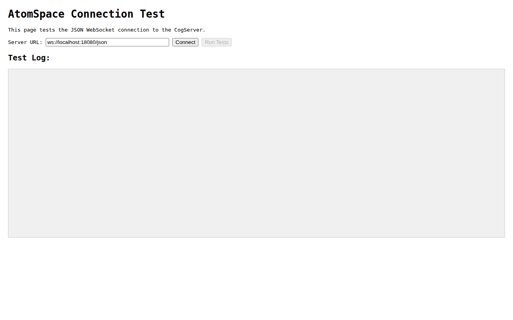
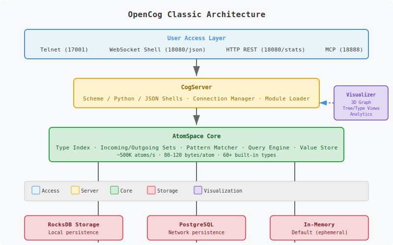

# OpenCog AtomSpace — Live Demo Stack

> **In-memory hypergraph knowledge database** with a running CogServer, WebSocket REPL, and web visualizer. Built from source on Ubuntu 24.04 / GCC 14 — commit [`c8d633bf27`](https://github.com/opencog/atomspace/commit/c8d633bf27) (v5.0.3-stable).

<p align="center">
  <a href="https://opencog.org"></a>
  <a href="LICENSE"></a>
  <a href="https://github.com/opencog/atomspace"></a>
  <a href="CONTRIBUTORS.md"></a>
  <a href="https://github.com/NullLabTests/opencog-codespace-demo"></a>
  <a href="Dockerfile"></a>
  <a href=".github/workflows/verify.yml"></a>
  <a href=".github/workflows/codeql.yml"></a>
  <a href="https://discord.gg/vxPc6sz"></a>
  <a href="CONTRIBUTING.md"></a>
</p>

---

## Quick Start

```bash
telnet localhost 17001    # Connect to the Scheme REPL
```

Then create your first atoms:

```scheme
(Concept "hello-world")
(Concept "opencog")
(Inheritance (Concept "cat") (Concept "animal"))
(cog-evaluate! (Plus (Number 1) (Number 2)))
(cog-execute! (Get (Inheritance (Variable "$X") (Concept "animal"))))
```

**Also try:**
- **WebSocket Shell** — [`http://localhost:18080/websockets/demo.html`](http://localhost:18080/websockets/demo.html)
- **Guided tour** — `cat demo/comprehensive-demo.scm | nc localhost 17001`
- **3D Visualizer** — [`http://localhost:18080/visualizer/`](http://localhost:18080/visualizer/)

---

## Features

| Capability | How |
|---|---|
| **Hypergraph database** | Typed, directed metagraph — edges connect any number of nodes, and edges can point to edges |
| **Pattern matching** | Subgraph isomorphism queries with variables — `GetLink`, `BindLink` |
| **Graph rewriting** | Automatic knowledge inference — match a pattern, instantiate a rewrite |
| **Interactive REPL** | Telnet (port 17001) + WebSocket (port 18080) — Scheme, Python, JSON, S-expressions |
| **3D visualizer** | 6 browser views: 3D graph, tree, type distribution, analytics dashboard, WebSocket shell, JSON tester |
| **Persistence** | RocksDB and PostgreSQL backends |
| **6-language API** | Python, JavaScript, Go, Ruby, Rust, curl — all over WebSocket JSON protocol |
| **Docker support** | Single-command build and run |
| **CI/CD** | GitHub Actions workflow builds, starts, and tests the full stack |

---

## Demo

<p align="center">
  
  <br>
  <em>Live REPL session: creating atoms, building relationships, querying, and evaluating arithmetic.</em>
</p>

All visualizer pages are served at `http://localhost:18080/visualizer/`.

| Page | URL | Purpose | Preview |
|---|---|---|---|
| 3D Graph Browser | `/visualizer/` | 3D knowledge graph — click, drag, zoom |  |
| Tree View | `/visualizer/tree-view.html` | Hierarchical layout for taxonomy inspection |  |
| Type View | `/visualizer/type-view.html` | Atoms grouped by type |  |
| Analytics | `/visualizer/analytics.html` | Real-time stats: counts, degrees, type pie |  |
| WebSocket Shell | `/websockets/demo.html` | Browser-based interactive REPL |  |
| JSON Test | `/websockets/json-test.html` | Raw JSON-over-WebSocket developer tool |  |
| Server Status | `/stats` | Loaded modules, uptime, connections |  |

---

## Integration

Connect from any language via the JSON WebSocket protocol at `ws://localhost:18080/json`.

```python
# Python
import asyncio, json, websockets
async def ask(expr):
    async with websockets.connect("ws://localhost:18080/json") as ws:
        await ws.send(json.dumps({"command": "scheme", "body": expr}))
        return json.loads(await ws.recv())
asyncio.run(ask("(cog-count-atoms)"))
```

```javascript
// Node.js
const WebSocket = require('ws');
const ws = new WebSocket('ws://localhost:18080/json');
ws.on('open', () => ws.send(JSON.stringify({command:'scheme', body:'(cog-count-atoms)'})));
ws.on('message', d => console.log(JSON.parse(d.toString())));
```

```bash
# curl (HTTP stats API)
curl -s http://localhost:18080/stats | python3 -m json.tool
```

Full examples for **Go, Ruby, Rust** in [docs/integrations.md](docs/integrations.md).

---

## Architecture



| Layer | Component | Role |
|---|---|---|
| **Network** | CogServer | Serves REPL (telnet:17001), Web UI (HTTP/WS:18080), MCP (:18888) |
| **Database** | libatomspace | In-memory concurrent hash map — all atoms, indexes, type system |
| **Query** | Pattern Matcher + Graph Rewriter | Subgraph isomorphism, BindLink rewrites |
| **Values** | Value System | Float, string, vector, truth value attachments per atom |
| **Storage** | RocksDB / PostgreSQL / CogStorage | Optional persistence backends |

Loaded CogServer modules: `SchemeShell`, `PythonShell`, `JsonShell`, `SexprShell`, `TopShell`, `BuiltinRequestsModule`.

See [docs/architecture.md](docs/architecture.md) for the full ASCII diagram and component breakdown.

---

## Documentation

| Guide | File | Covers |
|---|---|---|
| Getting Started | [docs/getting-started.md](docs/getting-started.md) | Three connection methods + first atoms |
| Atomese Primer | [docs/atomese-primer.md](docs/atomese-primer.md) | Full language tour: types, links, pattern matching, truth values |
| Architecture | [docs/architecture.md](docs/architecture.md) | Full ASCII diagram, component breakdown, data flow |
| Ecosystem Map | [docs/ecosystem.md](docs/ecosystem.md) | Project map (PLN, MOSES, Hyperon/MeTTa, NLP) + community channels |
| Knowledge Patterns | [docs/knowledge-patterns.md](docs/knowledge-patterns.md) | 12 common KR patterns with Atomese examples |
| Atom Types Reference | [docs/atom-types-reference.md](docs/atom-types-reference.md) | Full type catalog with hierarchy and examples |
| Visualizer Pages | [docs/visualizer-pages.md](docs/visualizer-pages.md) | Guide to each visualizer page with screenshots |
| Integration Examples | [docs/integrations.md](docs/integrations.md) | 6 languages: Python, JS, Go, Ruby, Rust, curl |
| API Reference | [docs/api.md](docs/api.md) | HTTP, WebSocket, TCP endpoint documentation |
| Vocabulary | [docs/vocabulary.md](docs/vocabulary.md) | Quick reference: types, functions, truth values |
| Glossary | [docs/glossary.md](docs/glossary.md) | Define all OpenCog terminology |
| Best Practices | [docs/best-practices.md](docs/best-practices.md) | Naming, ontology design, query optimization |
| Build from Source | [docs/build-from-source.md](docs/build-from-source.md) | Step-by-step build instructions for Ubuntu 24.04 |
| FAQ | [docs/faq.md](docs/faq.md) | Frequently asked questions |
| Getting Involved | [docs/getting-involved.md](docs/getting-involved.md) | How to contribute to upstream OpenCog |
| Neuro-Symbolic AI | [docs/neuro-symbolic.md](docs/neuro-symbolic.md) | Bridge AtomSpace with LLMs |
| Performance Guide | [docs/performance-guide.md](docs/performance-guide.md) | Throughput, query optimization, memory |
| Migration Guide | [docs/migration-guide.md](docs/migration-guide.md) | Classic → Hyperon / MeTTa |
| History | [docs/history.md](docs/history.md) | OpenCog timeline 2001–present |
| Remote Tunneling | [docs/tunneling.md](docs/tunneling.md) | SSH/SOCKS proxy for remote access |

### Demo Scripts

All 23 scripts run with `cat <script> | nc localhost 17001`. See [demo/use-cases/README.md](demo/use-cases/README.md) for details.

| Script | Domain | Concepts |
|---|---|---|
| [comprehensive-demo.scm](demo/comprehensive-demo.scm) | General | 10-part guided tour: taxonomy, properties, queries, rewriting, truth values, arithmetic |
| [demo.scm](demo.scm) | General | Quick starter — atoms, inheritance, arithmetic |
| [evaluation-demo.scm](demo/evaluation-demo.scm) | AI | Neuro-symbolic knowledge base with LLM-style queries |
| [stress-test.scm](demo/stress-test.scm) | Perf | Bulk creation of 1000 atoms with timing |
| [truth-values.scm](demo/truth-values.scm) | System | STV, defaults, components, merge operations |
| [values-api.scm](demo/values-api.scm) | System | FloatValue, StringValue, key-value store per atom |
| [rest-api.scm](demo/rest-api.scm) | API | HTTP stats endpoint usage |
| [taxonomy.scm](demo/use-cases/taxonomy.scm) | Biology | Inheritance hierarchy, classification queries |
| [family-tree.scm](demo/use-cases/family-tree.scm) | Genealogy | Multi-generational relations, property queries |
| [commonsense.scm](demo/use-cases/commonsense.scm) | Everyday | Object properties, locations, causal chains |
| [expert-system.scm](demo/use-cases/expert-system.scm) | Medicine | Rule-based diagnosis with implication links |
| [planning.scm](demo/use-cases/planning.scm) | Robotics | State, action preconditions, affordances |
| [temporal.scm](demo/use-cases/temporal.scm) | Scheduling | Events, time points, ordering (Before/AtTime) |
| [semantic-net.scm](demo/use-cases/semantic-net.scm) | Philosophy | Socrates syllogism, semantic network queries |
| [analogies.scm](demo/use-cases/analogies.scm) | Cognition | Cross-domain analogy via SimilarityLink |
| [math-reasoning.scm](demo/use-cases/math-reasoning.scm) | Math | Arithmetic truths, geometric properties |
| [reasoning-pipeline.scm](demo/use-cases/reasoning-pipeline.scm) | Multi | Chain: taxonomy → properties → rewrite → cross-query |
| [rewriting.scm](demo/use-cases/rewriting.scm) | Inference | BindLink-based automatic knowledge inference |
| [chatbot-memory.scm](demo/use-cases/chatbot-memory.scm) | Conversational | Message history, user facts, temporal order |
| [recipe-knowledge.scm](demo/use-cases/recipe-knowledge.scm) | Cooking | Recipes, ingredients, dietary categories |
| [music-theory.scm](demo/use-cases/music-theory.scm) | Music | Notes, scales, chords, intervals |
| [geography.scm](demo/use-cases/geography.scm) | Geography | Countries, capitals, continents, population |
| [diagnostics.scm](demo/use-cases/diagnostics.scm) | Automotive | Multi-symptom diagnostic rules |

---

## Deployment Options

### Quick Reference

| Tool | File | What it does |
|---|---|---|
| **Makefile** | [Makefile](Makefile) | `make start`, `make stop`, `make test`, `make docker-build` |
| **Docker** | [Dockerfile](Dockerfile) | `docker build -t opencog-demo . && docker run ...` |
| **Docker Compose** | [docker-compose.yml](docker-compose.yml) | `docker compose up -d` — multi-service orchestration |
| **Start Script** | [start-cogserver.sh](start-cogserver.sh) | One-command CogServer restart |
| **Python CLI** | [cogcli.py](cogcli.py) | `python3 cogcli.py count` — REPL commands from the shell |
| **Load Tester** | [loadtest.py](loadtest.py) | `python3 loadtest.py --count 1000` — throughput benchmark |
| **Config Template** | [.env.example](.env.example) | Environment variable reference |
| **Init Script** | [init-cogserver.scm](init-cogserver.scm) | Initialize CogServer with modules and anchors |
| **Benchmark** | [benchmark.scm](benchmark.scm) | Atom creation + query throughput measurement |
| **REPL Helper** | [repl.sh](repl.sh) | `./repl.sh` — quick telnet with rlwrap |
| **Health Check** | [docker-healthcheck.sh](docker-healthcheck.sh) | Docker container health probe |
| **Integration Test** | [test-integration.sh](test-integration.sh) | Full endpoint smoke test |
| **CI Pipeline** | [.github/workflows/verify.yml](.github/workflows/verify.yml) | Build + test on every push |

### Build Times

| Component | Time (4 cores) |
|---|---|
| cogutil | ~22s |
| atomspace (384 files + Guile bindings) | ~6m 38s |
| atomspace-storage | ~1m 15s |
| cogserver | ~4m 15s |
| **Total** | **~12 minutes** |

---

## Ecosystem

```
Application / Reasoning:    PLN · MOSES · Pattern Miner · OpenPsi
Core Platform:              AtomSpace · CogServer · cogutil
Storage:                    RocksDB · PostgreSQL · CogStorage
NLP & Language:             RelEx · Link Grammar · Relex2Logic
Next Gen:                   Hyperon / MeTTa (trueagi-io)
```

| Repository | Status | Description |
|---|---|---|
| [opencog/atomspace](https://github.com/opencog/atomspace) | ✅ Active | Hypergraph database — **this stack** |
| [opencog/cogserver](https://github.com/opencog/cogserver) | ✅ Active | Network server (REPL / WebSocket / HTTP / MCP) |
| [opencog/cogutil](https://github.com/opencog/cogutil) | ✅ Active | Low-level C++ utilities |
| [opencog/atomspace-storage](https://github.com/opencog/atomspace-storage) | ✅ Active | RocksDB + PostgreSQL backends |
| [opencog/asmoses](https://github.com/opencog/asmoses) | 🟡 Maintained | MOSES evolutionary learning |
| [opencog/link-grammar](https://github.com/opencog/link-grammar) | ✅ Active | CMU Link Grammar NL parser |
| [trueagi-io/hyperon-wasm](https://github.com/trueagi-io/hyperon-wasm) | ✅ Active | MeTTa / Hyperon — successor architecture |

---

## Background

The OpenCog AtomSpace has been in **continuous development since 2008**. This demo proves:

1. **The full stack builds cleanly** on Ubuntu 24.04 with GCC 14 — no patches needed.
2. **All components interoperate** — a single CogServer serves WebSocket, HTTP, MCP, and telnet simultaneously.
3. **The ecosystem is alive** — successor project Hyperon / MeTTa is under active development at TrueAGI.
4. **Zero-configuration exploration** — connect via telnet, browser, or script immediately.

For a comprehensive overview of the OpenCog architecture and the
theoretical framework, see the arXiv paper
[*"OpenCog Hyperon: A Framework for AGI at the Human Level and Beyond"*](https://arxiv.org/abs/2310.18318)
(Goertzel et al., 2023, 13 co-authors).

---

## Citing This Work

If you use this repository in research or education, please cite:

```bibtex
@misc{opencog-demo-2026,
  author = {OpenCog Contributors},
  title = {OpenCog AtomSpace — Live Demo Stack},
  year = {2026},
  publisher = {GitHub},
  url = {https://github.com/NullLabTests/opencog-codespace-demo}
}
```

For the OpenCog framework itself:

```bibtex
@article{goertzel2023opencog,
  title={OpenCog Hyperon: A Framework for AGI at the Human Level and Beyond},
  author={Goertzel, Ben and others},
  journal={arXiv preprint arXiv:2310.18318},
  year={2023}
}
```

---

## Community

The OpenCog project has been built by **80+ contributors** over **20+ years**,
from the original Novamente Cognition Engine (2001) through OpenCog Classic
(2008) to today's Hyperon / MeTTa (active development at TrueAGI).

| Channel | Link | Purpose |
|---|---|---|
| **Discord** | https://discord.gg/vxPc6sz | Daily chat — most active community hub |
| **GitHub** | https://github.com/opencog | 90+ repos, 500+ followers — code, issues, PRs |
| **Wiki** | https://wiki.opencog.org | Tutorials, concepts, architecture docs |
| **Mailing List** | opencog@googlegroups.com | Long-form discussion, announcements |
| **Blog** | https://blog.opencog.org | Project updates, research posts |
| **Reddit** | https://reddit.com/r/opencog | Community discussion |
| **Hyperon Tutorials** | https://metta-lang.dev/docs/learn/learn.html | Learn the successor MeTTa language |

**How to get involved:**
1. Join the [Discord](https://discord.gg/vxPc6sz) — this is where daily development discussion happens
2. Browse open [AtomSpace issues](https://github.com/opencog/atomspace/issues) or [Hyperon issues](https://github.com/trueagi-io/hyperon-wasm/issues)
3. Submit PRs — all repositories accept contributions
4. Contact **Linas Vepstas** (linasvepstas@gmail.com) for developer onboarding to OpenCog Classic
5. Explore [SingularityNET Deep Funding](https://deepfunding.ai) for AGI research grants

### Repository Standards

| Standard | File |
|---|---|
| Contributor Guide | [CONTRIBUTING.md](CONTRIBUTING.md) |
| Code of Conduct | [CODE_OF_CONDUCT.md](CODE_OF_CONDUCT.md) |
| Security Policy | [SECURITY.md](SECURITY.md) |
| Troubleshooting | [TROUBLESHOOTING.md](TROUBLESHOOTING.md) |
| FAQ | [docs/faq.md](docs/faq.md) |
| Getting Involved | [docs/getting-involved.md](docs/getting-involved.md) |
| Glossary | [docs/glossary.md](docs/glossary.md) |
| Best Practices | [docs/best-practices.md](docs/best-practices.md) |
| Roadmap | [ROADMAP.md](ROADMAP.md) |
| Support | [SUPPORT.md](SUPPORT.md) |
| Changelog | [CHANGELOG.md](CHANGELOG.md) |
| Full Contributor Credits | [CONTRIBUTORS.md](CONTRIBUTORS.md) |

---

## License

**Apache 2.0** — see [LICENSE](LICENSE). Upstream components (AtomSpace, CogServer, cogutil) remain AGPL-3.0 or LGPL-3.0.

---

<p align="center">
  <sub>
    <a href="https://opencog.org">OpenCog.org</a> ·
    <a href="https://github.com/opencog/atomspace">AtomSpace on GitHub</a> ·
    <a href="https://github.com/trueagi-io/hyperon-wasm">Hyperon / MeTTa</a> ·
    <a href="https://discord.gg/vxPc6sz">Discord</a> ·
    Built with <a href="https://opencode.ai">OpenCode</a>
  </sub>
</p>
