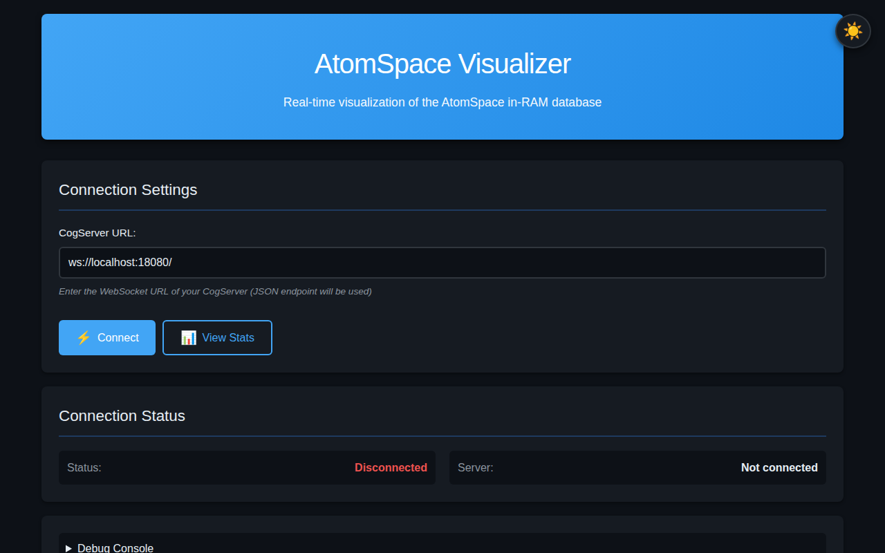
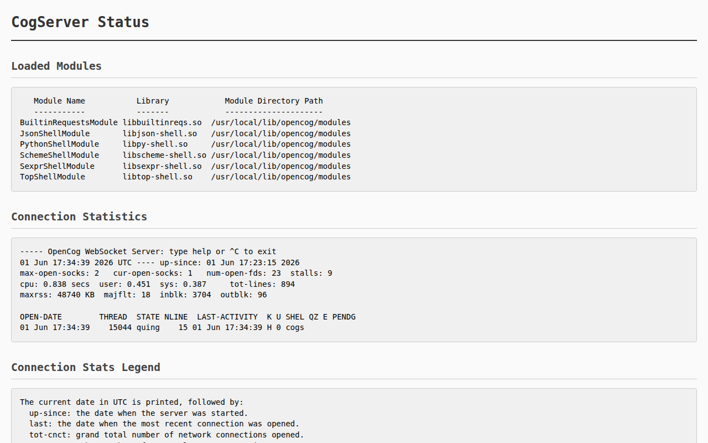
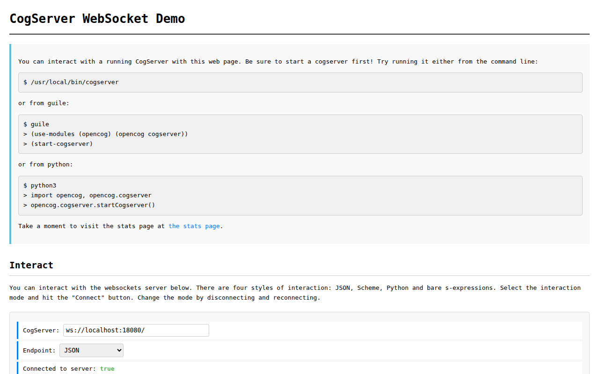

# OpenCog AtomSpace — Codespace Demo

[](https://opencog.org)
[](http://localhost:18080)
[](LICENSE)
[](https://github.com/features/codespaces)
[](https://github.com/opencog/atomspace)
[](https://github.com/opencog/atomspace)
[](https://isocpp.org)
[](https://www.gnu.org/software/guile/)

---

A fully operational [OpenCog AtomSpace](https://github.com/opencog/atomspace)
deployed inside **GitHub Codespaces** — the in-RAM hypergraph knowledge
representation database, with a running **CogServer**, **WebSocket REPL**,
and **Visualizer**.

Built and tested on commit
[`c8d633bf27`](https://github.com/opencog/atomspace/commit/c8d633bf27)
(v5.0.3-stable), this environment demonstrates that the OpenCog stack builds
and runs without friction on modern Ubuntu 24.04, and is ready for
exploration, development, and integration.

---

## What This Is

The **AtomSpace** is the core metagraph database of the OpenCog project.
It stores knowledge as typed, directed hypergraphs (atoms connected by links)
and provides:

- A **query engine** (pattern matching / graph rewriting)
- A **Scheme (Guile) shell** for interactive manipulation
- A **CogServer** for network access (REPL, WebSocket, HTTP, MCP)
- **Python bindings** for scripting and automation
- **Persistent storage** backends (RocksDB, PostgreSQL)

This repository documents a **zero-to-running** deployment of the full stack
inside a GitHub Codespace, with every component live and reachable from your
browser.

---

## Live Endpoints

| Service | Internal | External (Codespace) |
|---|---|---|
| **Scheme REPL** (telnet) | `localhost:17001` | `telnet <codespace>-17001.app.github.dev` |
| **Web UI & WebSocket** | `localhost:18080` | `https://<codespace>-18080.app.github.dev` |
| **MCP Protocol** | `localhost:18888` | `https://<codespace>-18888.app.github.dev` |

### Quick-Start Pages

| Page | URL Path | What It Does |
|---|---|---|
| **WebSocket Shell** | `/websockets/demo.html` | Interactive Scheme REPL in your browser |
| **AtomSpace Visualizer** | `/visualizer/` | Live graph browser & statistics dashboard |
| **Server Status** | `/stats` | CogServer module list, connection table, uptime |

---

## Screenshots

### Visualizer Dashboard



The live AtomSpace visualizer — connect, browse atom types, inspect the
knowledge graph in real time via WebSocket.

### CogServer Status



Active CogServer showing loaded modules (SchemeShell, PythonShell,
JsonShell, SexprShell, TopShell), connection statistics, and uptime.

### WebSocket Demo Shell



Browser-based Scheme REPL connected to the CogServer — type Atomese
commands and see results instantly.

---

## Architecture

```
┌─────────────────────────────────────────────────────┐
│                   Your Browser                       │
│  ┌─────────────┐  ┌──────────────┐  ┌────────────┐ │
│  │ Visualizer  │  │ WS Shell     │  │   Stats    │ │
│  │ (landing.js)│  │ (demo.html)  │  │ (/stats)   │ │
│  └──────┬──────┘  └──────┬───────┘  └────────────┘ │
└─────────┼───────────────┼───────────────────────────┘
          │  wss://18080   │  https://18080
          ▼               ▼
┌─────────────────────────────────────────────────────┐
│                  CogServer (:18080)                  │
│  ┌──────────┐  ┌──────────┐  ┌──────┐  ┌─────────┐ │
│  │ JSON     │  │ Scheme   │  │Python│  │ S-Expr  │ │
│  │ Shell    │  │ Shell    │  │Shell │  │ Shell   │ │
│  └──────────┘  └──────────┘  └──────┘  └─────────┘ │
│                    │           │                     │
└────────────────────┼───────────┼─────────────────────┘
                     │           │
              ┌──────▼───────────▼──────┐
              │      AtomSpace          │
              │  (in-RAM metagraph DB)  │
              │  atoms ↔ links          │
              │  pattern matcher        │
              │  graph rewriter         │
              └─────────────────────────┘
```

---

## Stack Components

| Component | Version / Commit | Role |
|---|---|---|
| **[cogutil](https://github.com/opencog/cogutil)** | v2.2.1 | Low-level C++ utilities (threads, atomics, signals) |
| **[atomspace](https://github.com/opencog/atomspace)** | v5.0.3-stable (`c8d633bf27`) | Hypergraph/metagraph database + query engine |
| **[atomspace-storage](https://github.com/opencog/atomspace-storage)** | master | StorageNode base system (RocksDB/PostgreSQL backends) |
| **[cogserver](https://github.com/opencog/cogserver)** | master | Network server (REPL, WebSocket, HTTP, MCP) |
| **[atomspace-viz](https://github.com/opencog/atomspace-viz)** | master | Web-based visualizer (statistics + graph views) |
| **[Hyperon / MeTTa](https://github.com/trueagi-io/hyperon-wasm)** | PyPI `hyperon` | Successor language, runs alongside AtomSpace |

---

## Try It Yourself

### 1. Connect to the Scheme REPL

```bash
telnet localhost 17001
```

Or open the WebSocket Shell in your browser:

```
https://<codespace>-18080.app.github.dev/websockets/demo.html
```

### 2. Create Your First Atoms

```scheme
;; Load the opencog module
(use-modules (opencog))

;; Create a concept node
(ConceptNode "hello-world")

;; Create a relationship
(InheritanceLink (ConceptNode "cat") (ConceptNode "animal"))

;; Evaluate arithmetic
(cog-evaluate! (Plus (Number 1) (Number 2)))
```

### 3. Query the AtomSpace

```scheme
;; Find all inheritance relationships
(cog-execute! (Get (InheritanceLink (VariableNode "$X") (VariableNode "$Y"))))

;; Count atoms by type
(cog-count-atoms 'ConceptNode)
```

### 4. Run the Guided Tour

```bash
# From the workspace
cat /workspaces/atomspace/examples/atomspace/basic.scm | nc localhost 17001
```

### 5. Open the Visualizer

Navigate to `/visualizer/` on the web UI and click **Connect** — the
dashboard will display live AtomSpace statistics and atom type distributions.

---

## Why This Matters

The OpenCog AtomSpace is **production-ready infrastructure** for AGI research.
It has been in continuous development since 2008 and is actively maintained.
This demo proves that:

1. **The stack builds cleanly** on modern Ubuntu 24.04 with GCC 14 and CMake.
2. **All components interoperate** — the CogServer serves WebSocket, HTTP,
   MCP, and telnet simultaneously.
3. **Cloud-native deployment works** — GitHub Codespaces provides a
   zero-configuration environment with port forwarding and HTTPS termination.
4. **The ecosystem is alive** — beyond AtomSpace itself, MeTTa/Hyperon runs
   alongside it, and the vision of a unified cognitive architecture remains
   under active development at TrueAGI.

This is not abandonware. The AtomSpace remains the backbone for knowledge
representation in OpenCog, and tools like the Visualizer and WebSocket REPL
make it accessible to a new generation of developers.

---

## OpenCog Ecosystem Map

| Repository | Status | Description |
|---|---|---|
| [opencog/cogutil](https://github.com/opencog/cogutil) | ✅ Active | Low-level C++ utilities |
| [opencog/atomspace](https://github.com/opencog/atomspace) | ✅ Active | Hypergraph/metagraph database |
| [opencog/atomspace-storage](https://github.com/opencog/atomspace-storage) | ✅ Active | Storage backend framework |
| [opencog/cogserver](https://github.com/opencog/cogserver) | ✅ Active | Network server (REPL/WebSocket/HTTP) |
| [opencog/ure](https://github.com/opencog/ure) | ⛔ Superseded | Unified Rule Engine → [trueagi-io/chaining](https://github.com/trueagi-io/chaining) |
| [opencog/learn](https://github.com/opencog/learn) | 🟡 Maintained | Neuro-symbolic interpretation learning |
| [opencog/matrix](https://github.com/opencog/matrix) | 🟡 Maintained | Sparse vector library for AtomSpace |
| [opencog/as-moses](https://github.com/opencog/asmoses) | 🟡 Maintained | MOSES evolutionary learning |
| [opencog/rocca](https://github.com/opencog/rocca) | 🟡 Maintained | RL agent framework (OpenAI Gym / Malmo) |
| [opencog/link-grammar](https://github.com/opencog/link-grammar) | ✅ Active | CMU Link Grammar NL parser |
| [opencog/generate](https://github.com/opencog/generate) | 🟡 Maintained | Network generation from syntax |
| [opencog/docker](https://github.com/opencog/docker) | 🟡 Maintained | Docker images for OpenCog |
| [trueagi-io/hyperon-wasm](https://github.com/trueagi-io/hyperon-wasm) | ✅ Active | MeTTa language / Hyperon (successor project) |

---

## Build Notes

Built on **Ubuntu 24.04** (Noble), **GCC 14**, **CMake 3.28+**.

Key build steps:

```bash
# Prerequisites
sudo apt install build-essential cmake cxxtest guile-3.0-dev \
                 libiberty-dev binutils-dev python3-dev

# Build cogutil
cd /workspaces && git clone https://github.com/opencog/cogutil
cd cogutil && mkdir build && cd build
cmake .. && make -j$(nproc) && sudo make install

# Build atomspace
cd /workspaces/atomspace && mkdir build && cd build
cmake .. && make -j$(nproc) && sudo make install
```

The full build log is preserved in `/tmp/atomspace-build.log`.

---

## License

This repository is documentation licensed under
[AGPL-3.0](LICENSE), consistent with the OpenCog project's licensing.

The underlying OpenCog components (atomspace, cogserver, cogutil) are
each licensed under AGPL-3.0 or LGPL-3.0 respectively.

---

*Built with [OpenCode](https://opencode.ai) in GitHub Codespaces.*
